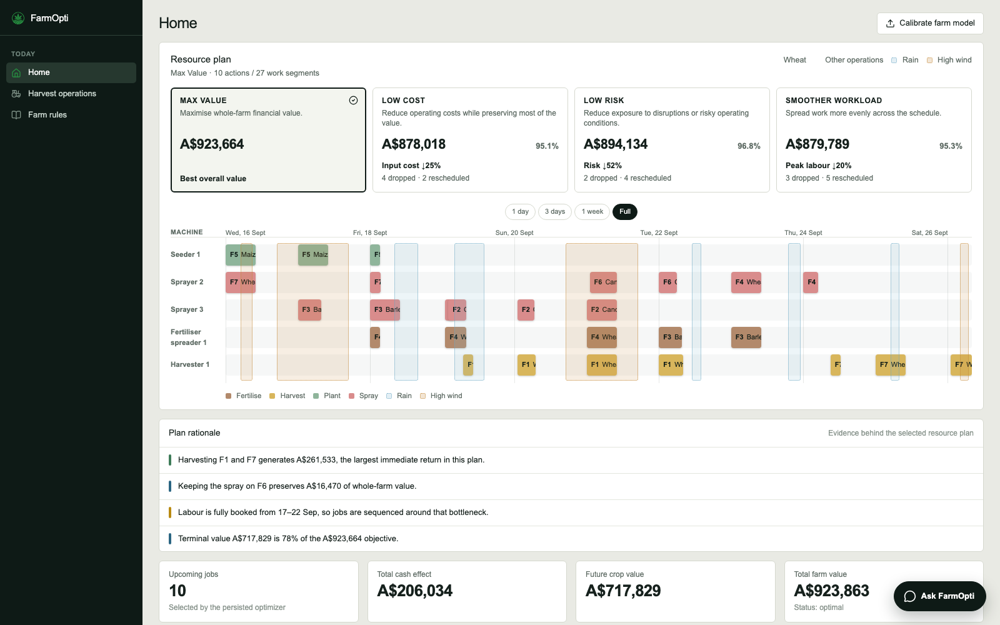

# FarmOpti — Harvest Operations Optimiser

FarmOpti replaces manual harvest scheduling with a real optimisation engine. Instead of a
farm manager mentally juggling weather, machines, labour and water limits, FarmOpti searches
the space of feasible schedules, solves for the financially best one, and lets the manager
adjust it by talking to it in plain English.

---

## Demo

[](https://youtu.be/9CGH3szSdds)



---

## What it does

- **Builds a full harvest schedule** across every field, machine, and operation (harvest,
  spray, irrigate, fertilise, plant), respecting machine/labour/water capacity and weather
  feasibility windows.
- **Accounts for weather**, both as a hard feasibility gate (e.g. no spraying above a wind
  threshold) and as a soft effect on work rate — bad conditions slow progress rather than
  simply blocking it outright.
- **Compares resource-plan alternatives** — max value, low cost, low risk, and smoother
  workload — each with its own schedule and a rationale panel explaining the tradeoffs.
- **Lets you set hard scheduling rules** in natural language ("never spray field F3 within
  24 hours of heavy rain") through a chat assistant, or via a structured Farm Rules panel.
  Every change is proposed, confirmed, then applied — nothing changes silently.
- **Re-optimises live** whenever a rule, machine, or config value changes, and narrates what
  changed and why.

---

## Architecture

```
components/YallambeeDashboard.tsx   React dashboard: schedule timeline, resource-plan
                                     selector, Farm Rules panel, chat assistant
app/api/*/route.ts                  Next.js routes (Cloudflare Workers) — proxy every
                                     write/reoptimise call to the sidecar over fetch()
lib/optimizer/server.ts             Local Node sidecar (port 4790) — the one process with
                                     a real filesystem and a working WASM solver loader
lib/optimizer/                      The optimisation pipeline + chatbot (see
                                     data/OPTIMISATION_README.md and
                                     data/FARMOPTI_DECISION_TO_LLM_README.md)
data/                                External variables, farm history, farm_rules.json,
                                     and pipeline outputs
```

The frontend is a Next.js/React 19 app served via `vinext` on Cloudflare Workers, which has
no persistent disk and can't load the solver's WASM module in-process. So every action that
needs real compute — reoptimising, running the pipeline, calling the LLM — is proxied over
`fetch()` to a plain Node sidecar (`lib/optimizer/server.ts`) running alongside `npm run dev`.
The sidecar is the only process that touches the filesystem and the solver directly.

### The optimisation pipeline

```
external variables + management plan
        -> 1. Candidate generation        (candidateGeneration.ts)
        -> 2. Field-state simulation      (fieldSimulator.ts)
        -> 3. Field-option search         (fieldOptions.ts, beam search)
        -> 4. Whole-farm MILP solve       (scheduleOptimizer.ts, HiGHS)
        -> optimal_schedule.csv
```

1. **Candidate generation** tests every possible start time for every management-plan
   operation against weather, machine, and labour feasibility, producing individually valid
   action timings.
2. **Field simulation** replays a sequence of actions on one field in order, since actions
   interact — irrigation changes moisture, which affects the next irrigation; spraying
   changes pest pressure; harvest removes the crop.
3. **Field-option search** (beam search) explores combinations of required and optional
   actions per field, keeping the best-scoring partial schedules and discarding the rest.
4. **Whole-farm optimisation** (HiGHS, a MILP solver) picks the combination of field options
   that maximises total financial value, subject to shared machine, labour, and water
   constraints across the whole farm and the full planning horizon.

The objective separates the **direct cash effect** of each action (revenue minus cost) from
its **terminal crop value** (what an unharvested or newly planted crop is still worth at the
end of the horizon), so future yield benefit is never counted twice. Full detail, including
every equation, is in `data/OPTIMISATION_README.md`.

### Weather-aware scheduling

Weather acts on the schedule in two ways: as a **feasibility gate** (some operations simply
can't run past a wind/rain/temperature threshold) and as an **efficiency multiplier** on work
already in progress (`lib/optimizer/weatherEffects.ts`) — a `WorkSegment` tracks both raw
clock time (`work_hours`) and weather-adjusted progress (`effective_work_hours`), since bad
weather can stretch how long a job takes without stopping it outright.

### Farm Rules — hard scheduling exclusions

A **Farm Rule** prohibits a (machine, field, operation) combination outright, optionally only
while a weather trigger has held within a lookback window (`lib/optimizer/rules/`). Rules are
enforced directly in candidate generation, so a confirmed rule is never violated by the
solver. Rules can be authored two ways:

- **Farm Rules panel** — a structured form (pick machine/field/operation and, optionally, a
  weather trigger).
- **Chat assistant** — describe it in plain English; the LLM structures it into the same
  rule shape, then presents it for confirmation before it's ever applied.

### Chat assistant — proposing changes, not deciding the plan

The chatbot (`lib/optimizer/chatbot/`) never picks the plan itself — the solver does. Its job
is to turn a manager's request into one of three structured proposals, then hand it to the
existing deterministic validation and confirm/apply/reoptimise pipeline:

| Proposal kind | Example | Effect |
|---|---|---|
| `config_update` | "Only spray when wind is below 15 km/h" | Edits a global threshold in `config.yaml` |
| `machine_change` | "We just bought a new harvester, M8" | Adds/updates an entry in the machine roster |
| `rule_change` | "Never spray F3 within 24h of heavy rain" | Adds/removes a Farm Rule |

Classification and field-extraction are split into two focused LLM calls per request (decide
the kind, then fill in only that kind's fields) rather than one large combined schema — this
is measurably more reliable with a small local model. The LLM runs via **Ollama** locally by
default, or **Groq** by setting `LLM_PROVIDER=groq`, with no other code changes required
(`lib/optimizer/chatbot/llmClient.ts`).

The assistant also answers questions about *why* a decision was made. Decision evidence
(what was selected, its direct financial effect, and the field-state transition it caused) is
extracted deterministically from the optimiser's own output before any LLM sees it — the LLM
interprets and communicates evidence, it never infers a reason from the raw schedule. See
`data/FARMOPTI_DECISION_TO_LLM_README.md` for the full extraction/retrieval/explanation flow.

---

## How to run

**Prerequisites:** Node.js 22+, npm. For the chat assistant's default provider, a local
[Ollama](https://ollama.com) server; otherwise set `LLM_PROVIDER=groq` with a Groq API key.

```bash
npm install
npm run dev              # Next.js dashboard on Cloudflare Workers (vinext)
npm run optimizer:server # local sidecar, in a second terminal — required for
                          # reoptimising, the chat assistant, and any write
```

Open `http://localhost:3000`.

**Other useful scripts:**

```bash
npm run optimizer:pipeline   # run the optimiser end-to-end from a clean state
npm run optimizer:chatbot    # talk to the decision assistant from the terminal
npm run optimizer:calibrate  # fit response curves from farm_history/history.csv
npm test                     # optimizer unit tests
npm run build                # production build
```

---

## Repository

`https://github.com/Reo906/FarmOpti`
